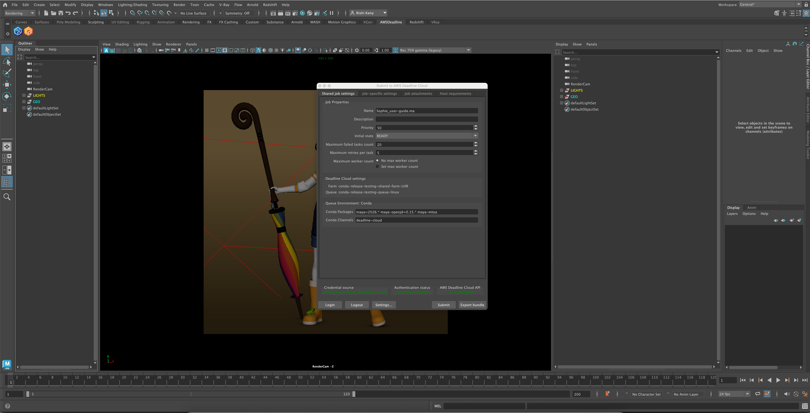

# AWS Deadline Cloud for Autodesk Maya User Guide

This guide provides step-by-step instructions for using AWS Deadline Cloud with Autodesk Maya to render your projects faster by distributing rendering tasks across multiple machines.

## What's Inside

This user guide covers:

- [Installation](installation.md) - How to install the Autodesk Maya submitter
- [Using the Submitter](using-submitter.md) - How to prepare and submit rendering jobs

## Support

Need help or have feedback? Here's how to get support:

- **[Report a bug or issue](https://github.com/aws-deadline/deadline-cloud-for-maya/issues)** - Report a bug or issue with the Maya adapter or submitter
